<h1 align="center">
  
</h1>

<p align="center">
  
  <a href="https://github.com/surajmaurya14?tab=followers"></a>
  
</p>

<p align="center">
  <em>Engineer focused on <b>Backend</b>, <b>Data Engineering</b>, and <b>Scalable Systems Architecture</b>. I build distributed systems, data pipelines, and cloud infrastructure that power real-world applications at scale. Off-keyboard you'll find me on Arch-based distros, playing chess, or cycling.</em>
</p>

<p align="center">
  <a href="https://linkedin.com/in/mauryasuraj" target="_blank"></a>
  <a href="mailto:mauryasuraju@gmail.com" target="_blank"></a>
  <a href="https://twitter.com/surajmaurya_14" target="_blank"></a>
  <a href="https://t.me/surajmaurya14" target="_blank"></a>
</p>

---

## 🧑‍💻 About Me

```yaml
name: Suraj Maurya
title: Backend Engineering · Data Engineering · Scalable Systems
location: Mumbai, India
current_role: Technical Lead
previously: [Skima.ai, Shaadi.com]
focus:
  - Distributed Systems & High-Throughput Backends
  - Data Pipelines & ML Platforms
  - Cloud Infrastructure & Observability
languages: [Go, Python, C++, Bash]
hobbies: [Arch Linux, Open Source, Chess, Cycling]
ask_me_about: kafka, kubernetes, feature_stores, etl, scaling
```

---

## 💼 Experience

| Role | Company | Period |
| :--- | :--- | :--- |
| **Technical Lead** | — | — |
| Senior Software Engineer | Skima.ai | Jul 2025 – Apr 2026 |
| Software Engineer 3 (SDE-3) | Shaadi.com | Apr 2024 – Jul 2025 |
| Software Engineer 1 & 2 | Shaadi.com | Jun 2022 – Mar 2024 |

---

## ✨ Featured Work

### 🤖 AI Interview Platform · *Skima.ai*

End-to-end automated technical interviewer with real-time voice AI. Go (Gin) backend orchestrating Python-based **LiveKit Agents**, integrating **Deepgram Nova-3** (STT) → **GPT-4o** (LLM) → **ElevenLabs Turbo v2.5** (TTS) into a **sub-second** conversational pipeline. Built reconnection / state-sync handlers for graceful network interruption recovery, a two-stage LLM prefill that dynamically adapts role-specific question flows, async transcript streaming to MongoDB with exponential backoff, and RabbitMQ-driven post-interview scoring. Deployed on **AWS EKS** with rolling updates.

`Go` `Gin` `Python asyncio` `LiveKit` `GPT-4o` `MongoDB` `RabbitMQ` `EKS`

### 🚀 Event Ingestion Platform · *Shaadi.com*

Horizontally scalable Kafka platform processing **100M+ events/day** with exactly-once semantics, CQRS, and idempotent writes. At-least-once delivery, fault isolation, and regional failover for 3 business-critical services — sustained **99.99% uptime** and reduced failover recovery time by **90%**. Self-healing ETL pipelines with automated schema diffing and versioning support backward-compatible evolution; powered analytics across **5M+ daily records**.

`Go` `Kafka` `Kubernetes` `DynamoDB` `Datadog`

### 🧠 ML Feature Store · *Shaadi.com*

Modular, versioned Feature Store (inspired by **Feast**) with offline/online sync — powering **30+ ML models** at **sub-150 ms** latency via Redis caching with LRU eviction. Cut model deployment lag from **4 hours to under 5 minutes**, halved model-onboarding time through a standardized schema catalog spanning MySQL, DynamoDB, and Kafka. Owned the low-latency feature delivery API (Go + AWS API Gateway) at **99.99% SLA**; partnered with revenue and data-science teams to lift conversion by **25%**. Companion Redshift snapshot orchestration service with rollback support enabled daily ML retraining and cut training backlog by **70%**.

`Go` `Redis` `Redshift` `MySQL` `DynamoDB` `Kafka` `AWS API Gateway`

### 🕷️ Competitive Intelligence System · *Shaadi.com*

Fault-tolerant, multithreaded scraper in Go with rotating proxies, rate-limiting, and dynamic selectors — monitored 5+ competitor sites with **zero-downtime config reloads**. Cut competitive-insight turnaround time by **90%**, helping the GTM team improve campaign ROI by **60%**.

`Go` `Concurrency` `Proxy Rotation`

---

## 📈 Impact at a Glance

> **4+ years** of distributed backend, data infrastructure, and platform engineering.

| 🚀 Metric | Outcome |
| :--- | :--- |
| Throughput at scale | **100M+ events/day** |
| Analytics records processed | **5M+ daily** |
| ML models powered | **30+ across use cases** |
| Service SLA | **99.99%** |
| Latency reduction | **60%** |
| Throughput increase | **4×** |
| Failover recovery time | **−90%** |
| Pipeline incident rate | **−70%** |
| Mean time to resolve | **−40%** |
| ML model deploy lag | **4 hr → < 5 min** |
| GPU utilization (A100) | **+40%** |
| Recognition | **2× Rockstar of the Month** (100+ engineers) |

---

## 🛠️ Tech Stack

#### 💻 Languages


#### 🛰️ Distributed Systems & Messaging


#### ☁️ Cloud & DevOps


> **AWS depth:** EC2 · ECS · EKS · Lambda · S3 · RDS · DynamoDB · ElastiCache · CloudWatch · Redshift · API Gateway

#### 🗄️ Databases & Data


> **Concepts:** SQL · ETL · Data Pipelines · Data Warehouse · Data Lake · Data Catalog · Schema Evolution · CQRS

#### 📊 Monitoring & Observability


> Logging · Alerting · SLO/SLA Metrics · Anomaly Detection · MTTR Optimization

#### 🔧 CI/CD & Tooling


> REST APIs · Microservices · Event-Driven Architecture

#### 🐧 Operating Systems


---

## 🎓 Education

**Bachelor of Engineering, Computer Science** — *Shree L.R. Tiwari College of Engineering, University of Mumbai* · CGPA **9.03 / 10** · 2018 – 2022

---

## 🏆 Achievements

- 🌟 **2× "Rockstar of the Month"** among 100+ engineers at Shaadi.com — for delivering scalable, production-grade systems with high impact
- 🛠️ Maintainer of **30+ internal backend repositories** supporting core real-time services and APIs
- 🧑‍🏫 Mentored **junior engineers to production-readiness in under 6 weeks**; delivered internal tech talks on back-pressure & schema evolution to **40+ engineers**
- 🥇 **Winner**, CODEYANTRA CODEY 2.0 national coding competition (2020)
- 🧠 **300+ DSA problems solved** across CodeChef, LeetCode, and GFG
- ⭐ **CodeChef 3★** — peak rating **1603**

<p align="center">
  
</p>

---

## 📊 GitHub Stats

<p align="center">
  
  
</p>

<p align="center">
  
</p>

<p align="center">
  
</p>

<p align="center">
  <picture>
    <source media="(prefers-color-scheme: dark)" srcset="https://raw.githubusercontent.com/surajmaurya14/surajmaurya14/output/github-contribution-grid-snake-dark.svg" />
    <source media="(prefers-color-scheme: light)" srcset="https://raw.githubusercontent.com/surajmaurya14/surajmaurya14/output/github-contribution-grid-snake.svg" />
    
  </picture>
</p>

---

## 📫 Let's Connect

<p align="center">
  <a href="https://linkedin.com/in/mauryasuraj"></a>
  <a href="mailto:mauryasuraju@gmail.com"></a>
  <a href="https://twitter.com/surajmaurya_14"></a>
  <a href="https://t.me/surajmaurya14"></a>
</p>

<p align="center"><sub><em>"Build for scale. Fail fast. Ship reliably."</em></sub></p>
